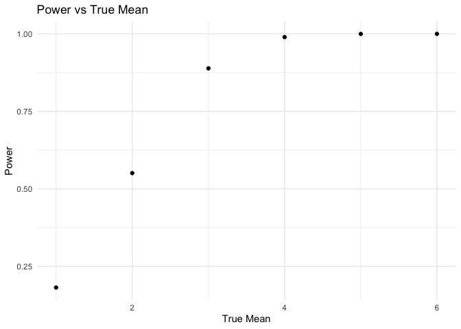

p8105_hw5_yz4990
================
Yucheng Zhao
2024-11-15

## Problem 1

## Problem 2

function for simulation and one-sample t-test

``` r
n = 30
sd = 5
mu = 0

sim_t_test = function(n = 30, mu, sd = 5, num_sim = 5000) {
  sim_data = expand_grid(
    iter = 1:num_sim,
    sample_size = n
  ) |> 
    mutate(
      x_df = map(sample_size, \(x) tibble(rnorm(x, mu, sd))), 
      t_test = map(x_df, \(x) broom::tidy(t.test(x)))
    ) |> 
    unnest(t_test)
  
  return(sim_data)
}

sim_5000 = sim_t_test(n = 30, mu = 0, sd = 5, num_sim = 5000) |> 
  select(estimate, p.value)
```

``` r
mu = c(1, 2, 3, 4, 5, 6)

sim_results = map_dfr(mu, \(x) sim_t_test(n = n, mu = x, sd = sd, num_sim = 5000) |> 
  mutate(true_mean = x)) |> 
  group_by(true_mean) |> 
  summarize(
    power = mean(p.value < 0.05), 
    avg_est_mu = mean(estimate), 
    avg_mu_rejected = mean(estimate[p.value < 0.05]),
    .groups = "drop"
  )
```

Power vs True Mean

``` r
sim_results |> 
  ggplot(aes(x = true_mean, y = power)) +
  geom_point() +
  labs(
    title = "Power vs True Mean",
    x = "True Mean",
    y = "Power"
  ) +
  theme_minimal()
```

<!-- -->

As the effect size increases, the power also increases. When the true
mean of the sample is close to 0, the power is less because the
difference between the sample mean and the null hypothesis is small and
hard to detect by the t-test. As the true mean becomes larger, the power
approaches to 1 because the difference between the sample mean and the
null hypothesis is large and easy to detect.

True Mean vs Average Estimated Mean

``` r
sim_results |> 
  ggplot(aes(x = true_mean, y = avg_est_mu)) +
  geom_point() +
  labs(
    title = "True Mean vs Average Estimated Mean",
    x = "Average Estimated Mean",
    y = "True Mean"
  ) +
  theme_minimal()
```

<!-- -->

``` r
sim_results |> 
  ggplot(aes(x = true_mean, y = avg_mu_rejected)) +
  geom_point() +
  labs(
    title = "True Mean vs Average Estimated Mean of the Rejected",
    x = "True Mean",
    y = "Average Estimated Mean of the Rejected"
  ) +
  theme_minimal()
```

<!-- -->

The average estimated mean of the rejected is closer or approximately
equal to the true mean when the true mean is large, and it deviates from
the true mean when the true mean is small. This is because there are
more cases where the null hypothesis mu = 0 is rejected as the true mean
increases.
