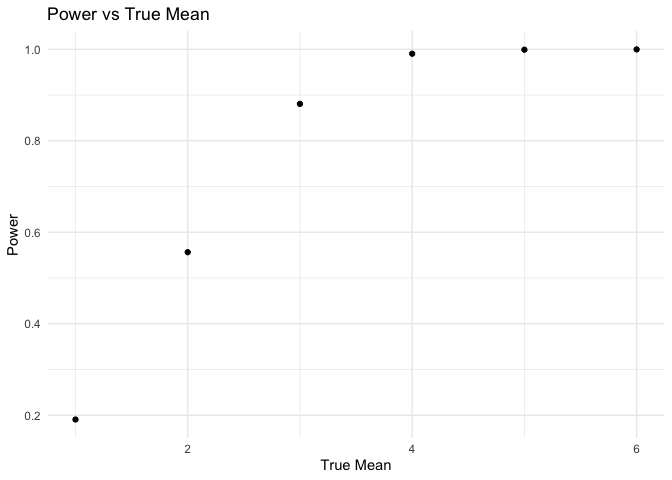
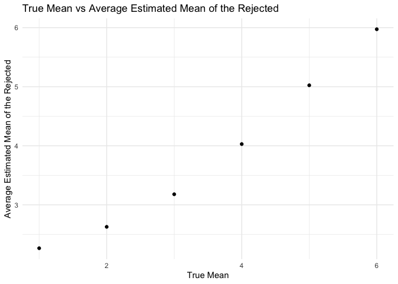

p8105_hw5_yz4990
================
Yucheng Zhao
2024-11-15

## Problem 1

function to check for same birthdays

``` r
birthday_check = function(group_size) {
  birthdays <- sample(1:365, size = group_size, replace = TRUE)
  duplicate = duplicated(birthdays)
  
  for (x in duplicate) {
    if (x == TRUE) {
      return(TRUE)
    }
  }
  return(FALSE)
}
```

1000 simulations and plot

``` r
sim_1000 = 
  expand_grid(
    iter = 1:1000, 
    group_size = 2:50
  ) |> 
  mutate(
    same_birthday = map_lgl(group_size, \(x) birthday_check(x))
  ) |> 
  group_by(group_size) |> 
  summarize(prob = mean(same_birthday))
  
  sim_1000 |> 
  ggplot(aes(x = group_size, y = prob)) +
  geom_point() + 
  labs(
    title = "Group Size vs. Probability of Having Same Birthday",
    x = "Group Size",
    y = "Probability"
  ) +
  theme_minimal()
```

<!-- -->

## Problem 2

function for simulation and one-sample t-test

``` r
n = 30
sd = 5
mu = 0

sim_t_test = function(n = 30, mu, sd = 5, num_sim = 5000) {
  sim_data = expand_grid(
    iter = 1:num_sim,
    sample_size = n
  ) |> 
    mutate(
      x_df = map(sample_size, \(x) tibble(rnorm(x, mu, sd))), 
      t_test = map(x_df, \(x) broom::tidy(t.test(x)))
    ) |> 
    unnest(t_test)
  
  return(sim_data)
}

sim_5000 = sim_t_test(n = 30, mu = 0, sd = 5, num_sim = 5000) |> 
  select(estimate, p.value)

sim_5000
```

    ## # A tibble: 5,000 × 2
    ##    estimate p.value
    ##       <dbl>   <dbl>
    ##  1    0.287 0.758  
    ##  2   -0.217 0.797  
    ##  3    2.25  0.00552
    ##  4   -0.950 0.279  
    ##  5   -0.246 0.792  
    ##  6    0.289 0.768  
    ##  7    0.674 0.445  
    ##  8   -0.664 0.422  
    ##  9    0.114 0.916  
    ## 10   -0.606 0.394  
    ## # ℹ 4,990 more rows

power, average estimated mean, average estimated mean of the rejected

``` r
mu = c(1, 2, 3, 4, 5, 6)

sim_results = map_dfr(mu, \(x) sim_t_test(n = n, mu = x, sd = sd, num_sim = 5000) |> 
  mutate(true_mean = x)) |> 
  group_by(true_mean) |> 
  summarize(
    power = mean(p.value < 0.05), 
    avg_est_mu = mean(estimate), 
    avg_mu_rejected = mean(estimate[p.value < 0.05]),
    .groups = "drop"
  )
```

Power vs True Mean

``` r
sim_results |> 
  ggplot(aes(x = true_mean, y = power)) +
  geom_point() +
  labs(
    title = "Power vs True Mean",
    x = "True Mean",
    y = "Power"
  ) +
  theme_minimal()
```

<!-- -->

As the effect size increases, the power also increases. When the true
mean of the sample is close to 0, the power is less because the
difference between the sample mean and the null hypothesis is small and
hard to detect by the t-test. As the true mean becomes larger, the power
approaches to 1 because the difference between the sample mean and the
null hypothesis is large and easy to detect.

True Mean vs Average Estimated Mean

``` r
sim_results |> 
  ggplot(aes(x = true_mean, y = avg_est_mu)) +
  geom_point() +
  labs(
    title = "True Mean vs Average Estimated Mean",
    x = "Average Estimated Mean",
    y = "True Mean"
  ) +
  theme_minimal()
```

<!-- -->

``` r
sim_results |> 
  ggplot(aes(x = true_mean, y = avg_mu_rejected)) +
  geom_point() +
  labs(
    title = "True Mean vs Average Estimated Mean of the Rejected",
    x = "True Mean",
    y = "Average Estimated Mean of the Rejected"
  ) +
  theme_minimal()
```

<!-- -->

The average estimated mean of the rejected is closer or approximately
equal to the true mean when the true mean is large, and it deviates from
the true mean when the true mean is small. This is because there are
more cases where the null hypothesis mu = 0 is rejected as the true mean
increases.

## Problem 3

``` r
homi_df = read_csv("./data/homicide-data.csv", 
                   na = c("NA", "Unknown", ""), 
                   ) |> 
  janitor::clean_names()
```

    ## Rows: 52179 Columns: 12
    ## ── Column specification ────────────────────────────────────────────────────────
    ## Delimiter: ","
    ## chr (8): uid, victim_last, victim_first, victim_race, victim_sex, city, stat...
    ## dbl (4): reported_date, victim_age, lat, lon
    ## 
    ## ℹ Use `spec()` to retrieve the full column specification for this data.
    ## ℹ Specify the column types or set `show_col_types = FALSE` to quiet this message.

The raw data has 12 columns X 52179 rows. The variables are uid,
reported_date, victim_last, victim_first, victim_race, victim_age,
victim_sex, city, state, lat, lon, disposition. There are some missing
values in the raw data, noted as “Unknown” or an empty space.

proportion test for Baltimore

``` r
homi_df = homi_df |> 
  mutate(
    city_state = paste(city, state, sep = ", ")
    ) |> 
  group_by(city_state) |> 
  summarize(
    total_homi = n(),
    unsolved = sum(disposition %in% c("Closed without arrest", "Open/No arrest"))
  )

baltimore_df = homi_df |> 
  filter(city_state == "Baltimore, MD")

baltimore_test = prop.test(
  pull(baltimore_df, unsolved), 
  pull(baltimore_df, total_homi)
) |> 
  broom::tidy() |> 
  select(estimate, conf.low, conf.high)

baltimore_test
```

    ## # A tibble: 1 × 3
    ##   estimate conf.low conf.high
    ##      <dbl>    <dbl>     <dbl>
    ## 1    0.646    0.628     0.663

proportion test for all cities and plots

``` r
cities_test = homi_df |> 
  mutate(
    prop_test = map2(unsolved, total_homi, \(x, y) prop.test(x, y) |> 
                       broom::tidy())
  ) |> 
  unnest(prop_test) |> 
  select(city_state, estimate, conf.low, conf.high)
```

    ## Warning: There was 1 warning in `mutate()`.
    ## ℹ In argument: `prop_test = map2(...)`.
    ## Caused by warning in `prop.test()`:
    ## ! Chi-squared approximation may be incorrect

``` r
  cities_test |> 
    mutate(city_state = forcats::fct_reorder(city_state, estimate)) |> 
    ggplot(aes(x = city_state, y = estimate)) +
    geom_point() +
    geom_errorbar(aes(ymin = conf.low, ymax = conf.high)) +
    theme_minimal() +
  labs(
    title = "Estimated Proportion of Unsolved Homicides in Cities with 95% CI",
    x = "City",
    y = "Proportion"
  ) +
  theme(
    axis.text.x = element_text(angle = 90, hjust = 1)
  )
```

<!-- -->
